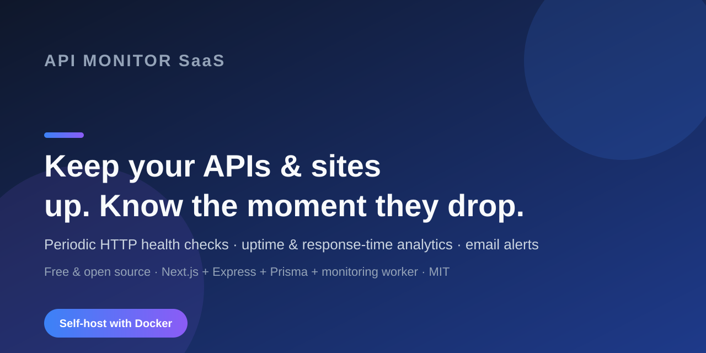

<div align="center">



# API Monitor SaaS

**Open-source API & website uptime monitoring, self-hostable**

[](LICENSE)
[](https://nodejs.org)
[](https://nextjs.org)
[](https://expressjs.com)
[](https://postgresql.org)
[](CONTRIBUTING.md)

</div>

---

## What is it

API Monitor SaaS monitors your APIs and websites by running periodic health checks, tracking uptime and response-time analytics, and notifying you by email when a service goes down — or comes back up. It ships as three services (Next.js dashboard, Express API, and a background monitoring worker) on a shared PostgreSQL database.

It is **self-hostable** with Docker Compose. Auth uses Supabase; billing (Stripe) and email (Resend) integrations are implemented in the backend but require your own keys (see [Configuration](#configuration)).

## What works

| Area | Status |
|------|--------|
| **Auth** (Supabase signup / signin / me / refresh / reset-password) | ✅ Built & working |
| **Monitor management** (create / list / detail / pause / resume / delete, plan limits) | ✅ Built & working |
| **Background checks** (worker runs HTTP probes on an interval, stores results) | ✅ Built & working |
| **Uptime & response-time analytics** (dashboard + per-monitor charts) | ✅ Built & working |
| **Alerts** (on status change to down/recovered; email via Resend, env-gated) | ✅ Built & working |
| **Public status pages** (public view per slug) | 🟡 Built (API + public page); management UI is next |
| **Billing** (Stripe checkout / portal / webhooks — backend only) | 🟡 Backend built; dashboard wiring is next |
| **Settings / Team / Workspaces** (pages) | 🔜 Coming next (placeholders) |
| **Slack / webhook / SMS notifications, Redis job queues** | 🔜 Planned (not implemented) |

> Every claim above reflects what the code actually does today. Anything described as "Coming next" is intentionally not over-sold.

## Quick Start

### Prerequisites
- Docker & Docker Compose (recommended path) **or** Node.js 22+ for manual setup
- A Supabase project (or local Supabase) for auth
- Optional: Stripe and Resend keys for billing / email

### 1. Clone

```bash
git clone https://github.com/dsk-dev-ai/api-monitor-saas.git
cd api-monitor-saas
```

### 2. Environment

```bash
cp .env.example .env
# Fill in at minimum: DATABASE_URL, SUPABASE_URL, SUPABASE_ANON_KEY, SUPABASE_SERVICE_ROLE_KEY
```

See [`ENV_GUIDE.txt`](ENV_GUIDE.txt) for exactly where each value comes from.

### 3. Start with Docker (recommended)

```bash
docker compose up -d

# Apply the database schema
docker compose exec backend npx prisma db push
```

Then open:
- Dashboard: http://localhost:3000
- API: http://localhost:3001
- Health: http://localhost:3001/health

### 4. Manual (development)

```bash
npm install
npx prisma db push --schema backend/prisma/schema.prisma
npm run db:generate
npm run dev
```

## Tech Stack

| Layer | Technology |
|-------|-----------|
| **Frontend** | Next.js 14, Tailwind CSS, shadcn/ui, Recharts, Zustand |
| **Backend** | Node.js 22, Express.js, Prisma ORM, Zod, Winston |
| **Worker** | Node.js, Axios, node-cron |
| **Database** | PostgreSQL 16 |
| **Auth** | Supabase Auth (JWT) |
| **Payments** | Stripe (Checkout + Billing Portal) — backend | 
| **Email** | Resend API — worker alerts |
| **Deploy** | Docker Compose |

## Architecture

```
┌─────────────┐     ┌─────────────┐     ┌─────────────┐
│   Next.js   │────▶│   Express   │────▶│  PostgreSQL │
│  Frontend   │     │    API      │     │             │
│  Port 3000  │◄────│  Port 3001  │     │             │
└─────────────┘     └──────┬──────┘     └─────────────┘
                           │
                    ┌──────┴──────┐
                    │   Worker    │
                    │ (checks)    │
                    └─────────────┘
```

The **worker** is the engine: it loads active monitors on an interval, runs HTTP probes (`worker/src/services/executor.ts`), stores each result as a `Check`, detects status changes, and writes `Alert` records (emailing via Resend when configured).

See [ARCHITECTURE.md](ARCHITECTURE.md) for the full system design and [DEVELOPMENT_PLAN.md](DEVELOPMENT_PLAN.md) for the roadmap.

## API

Backend routes are mounted under `/api/v1`. Highlights:

| Endpoint | Method | Description |
|----------|--------|-------------|
| `/api/v1/auth/signup` `signin` `me` | POST/POST/GET | Account + session |
| `/api/v1/monitors` | GET/POST | List / create monitors |
| `/api/v1/monitors/:id` | GET/PATCH/DELETE | Monitor CRUD |
| `/api/v1/analytics/overview` | GET | Dashboard stats |
| `/api/v1/alerts` | GET | Alert history |
| `/api/v1/status-pages/public/:slug` | GET | Public status view |

## Testing

```bash
npm run build
npm run lint
npm run typecheck
npm test
```

Backend unit/integration-route tests cover monitors, checks, and alerts (12 tests).

## Roadmap

- [x] v1.0 — MVP: monitoring, alerts, billing
- [x] v2.0 — Auth, dashboard, monitor management, analytics, alert system, worker service
- [ ] v3.0 — polished marketing site, accurate docs, professionalization pass (in progress)
- [ ] Team workspaces, status-page management UI, Stripe billing wiring in the dashboard
- [ ] Multi-region checks, more notification channels

## Contributing

Contributions are welcome! See [CONTRIBUTING.md](CONTRIBUTING.md) for the workflow and our [Code of Conduct](CODE_OF_CONDUCT.md).

## License

MIT — see [LICENSE](LICENSE).

---

<div align="center">

**Built by [dsk-dev-ai](https://github.com/dsk-dev-ai)**

⭐ Star this repo if you find it useful!

</div>
