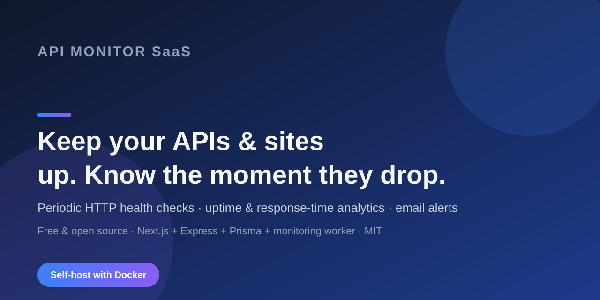

<div align="center">



# API Monitor SaaS

**Open-source API & website uptime monitoring, self-hostable**

[](https://api-monitor-saas-frontend.vercel.app)
[](LICENSE)
[](https://nodejs.org)
[](https://nextjs.org)
[](https://expressjs.com)
[](https://postgresql.org)
[](CONTRIBUTING.md)

</div>

---

## What is it

API Monitor SaaS monitors your APIs and websites by running periodic health checks, tracking uptime and response-time analytics, and notifying you by email when a service goes down — or comes back up. It ships as three services (Next.js dashboard, Express API, and a background monitoring worker) on a shared PostgreSQL database.

It is **self-hostable** with Docker Compose. Auth uses Supabase; billing (Stripe) and email (Resend) integrations are implemented in the backend but require your own keys (see [Configuration](#configuration)).

## What works

| Area | Status |
|------|--------|
| **Auth** (Supabase signup / signin / me / refresh / reset-password) | ✅ Built & working |
| **Monitor management** (create / list / detail / pause / resume / delete, plan limits) | ✅ Built & working |
| **Background checks** (worker runs HTTP probes on an interval, stores results) | ✅ Built & working |
| **Uptime & response-time analytics** (dashboard + per-monitor charts) | ✅ Built & working |
| **Alerts** (on status change to down/recovered; email via Resend, env-gated) | ✅ Built & working |
| **Public status pages** (public view per slug) | 🟡 Built (API + public page); management UI is next |
| **Billing** (Stripe checkout / portal / webhooks — backend only) | 🟡 Backend built; dashboard wiring is next |
| **Settings / Team / Workspaces** (pages) | 🔜 Coming next (placeholders) |
| **Slack / webhook / SMS notifications, Redis job queues** | 🔜 Planned (not implemented) |

> Every claim above reflects what the code actually does today. Anything described as "Coming next" is intentionally not over-sold.

## Quick Start

### Prerequisites
- Docker & Docker Compose (recommended path) **or** Node.js 22+ for manual setup
- A Supabase project (or local Supabase) for auth
- Optional: Stripe and Resend keys for billing / email

### 1. Clone

```bash
git clone https://github.com/dsk-dev-ai/api-monitor-saas.git
cd api-monitor-saas
```

### 2. Environment

```bash
cp .env.example .env
# Fill in at minimum: DATABASE_URL, SUPABASE_URL, SUPABASE_ANON_KEY, SUPABASE_SERVICE_ROLE_KEY
```

See [`ENV_GUIDE.txt`](ENV_GUIDE.txt) for exactly where each value comes from.

### 3. Start with Docker (recommended)

```bash
cp .env.example .env
# Fill in at minimum: SUPABASE_URL, SUPABASE_ANON_KEY, SUPABASE_SERVICE_ROLE_KEY
docker compose up -d
```

The stack comes up on its own — a one-shot `migrate` service applies the Prisma schema
before the API and worker start, so there is no manual migration step.

Then open:
- Dashboard: http://localhost:3000
- API: http://localhost:3001
- Health: http://localhost:3001/health

To confirm it is working:

```bash
curl -s localhost:3001/health
# {"status":"healthy","database":"connected",...}
```

Behind a mirror or proxy, pass the registry at build time:

```bash
docker compose build --build-arg NPM_REGISTRY=https://registry.example.com
```

### 4. Manual (development)

```bash
npm install
npm run db:migrate
npm run db:generate
npm run dev
```

## Tech Stack

| Layer | Technology |
|-------|-----------|
| **Frontend** | Next.js 14, Tailwind CSS, Radix UI, Recharts, Zustand |
| **Backend** | Node.js 22, Express.js, Prisma ORM, Zod, Winston, helmet |
| **Worker** | Node.js, Axios, node-cron |
| **Database** | PostgreSQL 16 |
| **Cache** | Redis 7 (provisioned; queue integration in progress) |
| **Auth** | Supabase Auth (JWT) |
| **Payments** | Stripe (Checkout + Billing Portal) — backend only |
| **Email** | Resend API — worker alerts |
| **Deploy** | Docker Compose |

## Architecture

```
┌─────────────┐     ┌─────────────┐     ┌─────────────┐
│   Next.js   │────▶│   Express   │────▶│  PostgreSQL │
│  Frontend   │     │    API      │     │             │
│  Port 3000  │◄────│  Port 3001  │     │             │
└─────────────┘     └──────┬──────┘     └─────────────┘
                           │
                    ┌──────┴──────┐
                    │   Worker    │
                    │ (checks)    │
                    └─────────────┘
```

The **worker** is the engine: it loads active monitors on an interval, runs HTTP probes (`worker/src/services/executor.ts`), stores each result as a `Check`, detects status changes, and writes `Alert` records (emailing via Resend when configured).

## Documentation

| Document | Covers |
|---|---|
| [ARCHITECTURE.md](ARCHITECTURE.md) | How the system actually works, component by component |
| [ROADMAP.md](ROADMAP.md) | What is planned, ordered by priority, with known gaps |
| [docs/DEPLOYMENT.md](docs/DEPLOYMENT.md) | Running it locally, on a host, and on managed platforms |
| [ENV_GUIDE.txt](ENV_GUIDE.txt) | Where to obtain each environment variable |
| [docs/THIRD_PARTY_LICENSES.md](docs/THIRD_PARTY_LICENSES.md) | Every dependency and its license |
| [SECURITY.md](SECURITY.md) | Reporting a vulnerability, and known limitations |
| [docs/](docs/) | Index, commercial boundary, and auth design |

### Known limitations

Two are worth knowing before you deploy this. Both are tracked in
[ROADMAP.md](ROADMAP.md).

- **SSRF residual risk.** The worker enforces a server-side destination policy —
  scheme allowlist, resolved-address classification, and a guard installed on the
  socket so the address dialled is the address approved — and it re-validates every
  redirect hop. 137 tests cover it, including a real listener on loopback that must
  never be reached. Four residual risks remain (DNS is still resolved before use, the
  range table is a denylist, a rebind on a redirect hop is argued rather than tested,
  `Host` is not pinned). Read them in [SECURITY.md](SECURITY.md) before exposing the
  product to untrusted users.
- **Response bodies are uncapped.** A monitor pointing at a large file can exhaust the
  worker's heap.
- **The worker cannot run more than one replica.** Scheduling state lives in
  process memory, so a second worker issues duplicate probes and duplicate alerts.
  The Redis-backed queue that fixes this is not implemented yet.


## API

Backend routes are mounted under `/api/v1`. Highlights:

| Endpoint | Method | Description |
|----------|--------|-------------|
| `/api/v1/auth/signup` `signin` `me` | POST/POST/GET | Account + session |
| `/api/v1/monitors` | GET/POST | List / create monitors |
| `/api/v1/monitors/:id` | GET/PATCH/DELETE | Monitor CRUD |
| `/api/v1/analytics/overview` | GET | Dashboard stats |
| `/api/v1/alerts` | GET | Alert history |
| `/api/v1/status-pages/public/:slug` | GET | Public status view |

## Testing

```bash
docker compose up -d
curl -s localhost:3001/health     # expect "status":"healthy"

npm run build
npm run lint
npm run typecheck
npm test              # backend: 21 tests
npm test -w worker    # worker: 137 tests
npm run licenses      # regenerate the license inventory
```

Coverage is uneven. The worker suite is substantial and security-critical: it covers the
SSRF destination policy, redirect handling, and the executor's check semantics, and it
was mutation-checked — disabling the destination guard makes it fail. The backend has 21
tests, covering monitor route validation and the error middleware. The frontend has none, and CI still runs with `--passWithNoTests`, so an empty suite would pass. Treat the
frontend and backend as untested rather than healthy.

## Roadmap

- [x] v1.0 — MVP: monitoring, alerts, billing
- [x] v2.0 — Auth, dashboard, monitor management, analytics, alert system, worker service
- [x] v3.0 — Professionalization: accurate claims/docs, community files, web fixes
- [x] P0 — SSRF destination policy, redirect re-validation, DNS rebinding guard
- [ ] P0 — cap monitor response body size
- [ ] P1 — Redis job queue: retries, backoff, dead-letter, safe horizontal scaling
- [ ] P2 — Self-hosted authentication, removing the Supabase dependency
- [ ] P3 — Workspaces, RBAC, audit log
- [ ] P4–P6 — Notification channels, incident management, billing entitlements

Full prioritized list in [ROADMAP.md](ROADMAP.md).

## Community

- **Discussions:** [GitHub Discussions](https://github.com/dsk-dev-ai/api-monitor-saas/discussions) — Q&A, ideas, show & tell
- **Issues:** [Report a bug](https://github.com/dsk-dev-ai/api-monitor-saas/issues/new?assignees=&labels=bug&template=bug_report.md) · [Request a feature](https://github.com/dsk-dev-ai/api-monitor-saas/issues/new?assignees=&labels=enhancement&template=feature_request.md)
- **Code of conduct:** [CODE_OF_CONDUCT.md](CODE_OF_CONDUCT.md)
- **Security:** [SECURITY.md](SECURITY.md)
- **Contributing:** [CONTRIBUTING.md](CONTRIBUTING.md)

## Sponsor

API Monitor SaaS is built and maintained by [Darshan Kachare](https://github.com/dsk-dev-ai) through [NextGenAI Labs](https://github.com/sponsors/dsk-dev-ai).

Sponsorship supports development infrastructure, documentation, and long-term maintenance of this open-source platform.

<a href="https://github.com/sponsors/dsk-dev-ai">
  
</a>

---

## License

MIT — see [LICENSE](LICENSE).

---

<div align="center">

**Built by [dsk-dev-ai](https://github.com/dsk-dev-ai)**

⭐ Star this repo if you find it useful!

</div>
